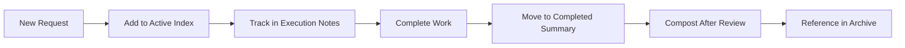
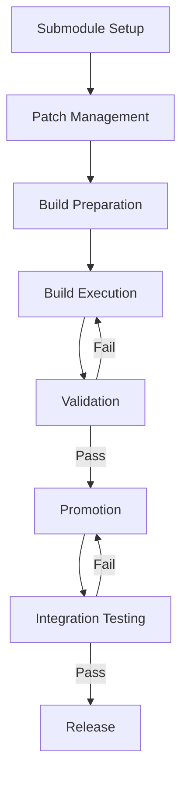

# 📚 COMPLETE DEV FLOW COMPENDIUM

**Sonic Family Development System — Classic Modern Mint Edition**

*Compiled: 2026-04-19* | *Version: 2.0.0* | *Status: Active*

---

## 🗺️ COMPENDIUM NAVIGATION

```
I. CORE PHILOSOPHY
   ├─ Development Principles
   ├─ Workspace Organization
   └─ Classic Modern Mint Integration

II. DEV FLOW ARCHITECTURE
   ├─ Active Execution Lanes
   ├─ Integration Coordination
   ├─ Process Documentation
   └─ Compost Archive System

III. VENTOY INTEGRATION (Complete)
   ├─ Integration Brief
   ├─ Promotion Workflow
   ├─ Validation Checklist
   └─ Integration Workflow

IV. UHOMENEST INTEGRATION
   ├─ v1.1.0 Integration Brief
   └─ v1.1.1 Sonic-Home Brief

V. EXECUTION SYSTEM
   ├─ Active Request Index
   ├─ Execution Notes (vA1.1.0)
   └─ Completed Summary

VI. PROCESS TOOLKIT
   ├─ Checklists
   ├─ Templates
   └─ Workflows

VII. GETTING STARTED
   └─ Daily Workflow Guide
```

---

## I. CORE PHILOSOPHY

### 🏛️ Development Principles

1. **Active Work Stays Visible** — Current execution lives in `dev/active/`
2. **Integration Points Are Explicit** — Cross-component work lives in `dev/integration/`
3. **Process Is Documented** — Workflows and checklists live in `dev/process/`
4. **Old Work Gets Composted** — Completed material moves to `dev/compost/`
5. **Vendor Is Sacred** — Never modify vendor directly; copy to code-vault

### 🗂️ Workspace Organization

```
Classic Modern Mint Workspace
├── vault/                  # Shared document vault (root spine)
├── code-vault/             # Source code repository
│   ├── @sandbox/           # Isolated experimentation
│   ├── @workspace/        # Active development
│   └── @toybox/            # Rapid prototyping
├── .local/vendor/         # Read-only sacred source
└── dev/                    # Development flow (this compendium)
```

### 🎨 Classic Modern Mint Integration

- **GUI Layer**: Cinnamon + Classic Modern Mac Theme
- **TUI Layer**: Sonic-Screwdriver + Bubble Tea
- **Service Layer**: uDosConnect / uHomeNest orchestration
- **Storage Layer**: Vault + Code-Vault + Root Spine
- **Boot Layer**: Ventoy fork with custom UI

---

## II. DEV FLOW ARCHITECTURE

### 📁 Structure Overview

```
dev/
├── GETTING-STARTED.md          # Daily workflow guide
├── COMPLETE-DEV-FLOW-COMPENDIUM.md  # This document
├── active/                     # Current 2-week execution
│   ├── active-index.md          # Active request index
│   ├── vA1.1.0-execution-notes.md # Daily execution log
│   └── completed-summary.md     # Recently completed work
│
├── integration/                # Cross-component coordination
│   ├── VENTOY-INTEGRATION-BRIEF.md
│   ├── UHOMENEST-V1.1.0-INTEGRATION-BRIEF.md
│   └── UHOMENEST-V1.1.1-SONIC-HOME-BRIEF.md
│
├── process/                    # Workflow definitions
│   ├── checklists/              # Validation procedures
│   │   ├── safe-to-push-checklist.md
│   │   └── ventoy-validation.md
│   ├── templates/               # Reusable patterns
│   │   ├── checklist-template.md
│   │   ├── integration-brief-template.md
│   │   └── workflow-template.md
│   └── workflows/               # End-to-end processes
│       └── ventoy-integration-workflow.md
│
├── compost/                    # Archived material
│   └── notes/                   # Historical documentation
│       ├── notes-readme.md
│       └── rounds-readme.md
│
└── README.md                   # Dev flow overview
```

### 🔄 Workflow Lifecycle



---

## III. VENTOY INTEGRATION (Complete)

### 📋 VENTOY-INTEGRATION-BRIEF.md

**Overview**: Ventoy submodule integration for Sonic Family bootable USB workflows.

**Current State**:
- Submodule: `Ventoy/` (https://github.com/fredporter/Ventoy)
- Module: `modules/ventoy/` (build scripts and integration glue)
- Docs: `docs/promotion.md` (promotion flow - fully documented)

**Integration Points**:

1. **Build Integration**
   - Location: `modules/ventoy/build.sh`
   - Status: Scaffold complete, patch integration pending
   - Next Steps: Define patch application workflow

2. **Promotion Flow**
   - Location: `docs/promotion.md`
   - Status: Fully documented with concrete steps
   - Next Steps: Implement CLI commands

3. **CLI Integration**
   - Location: `cmd/sonic/main.go` (future)
   - Status: Not yet implemented
   - Next Steps: Add `sonic ventoy` subcommands

**Open Questions**:
1. Patch Management: How are Ventoy patches tracked and applied?
2. Build Artifacts: Where are built Ventoy images stored?
3. Validation: What validation steps are required before promotion?
4. CLI Surface: What Ventoy-specific commands are needed in `sonic` CLI?

**Action Items**:
- [ ] Define patch application workflow in `modules/ventoy/`
- [ ] Expand `docs/promotion.md` with concrete promotion steps ✅
- [ ] Create Ventoy build validation checklist ✅
- [ ] Design CLI integration for Ventoy operations
- [ ] Document environment variables for Ventoy path discovery

**References**:
- Ventoy upstream: https://github.com/ventoy/Ventoy
- Family alignment: `Ventoy/DOC/uDos-family-alignment.md`
- Ventoy roadmap: `Ventoy/DOC/ROADMAP.md`

---

### 📦 Promotion Workflow (docs/promotion.md)

**Ventoy Promotion Workflow**:

1. **Patch Intake**
   - Input: Ventoy patches in `modules/ventoy/patches/`
   - Process: Apply patches to Ventoy submodule
   - Validation: `modules/ventoy/build.sh --verify`
   - Output: Patched Ventoy source in `Ventoy/`

2. **Local Build**
   - Input: Patched Ventoy source
   - Process: `modules/ventoy/build.sh`
   - Validation: Check build artifacts
   - Output: Ventoy build artifacts in `build/ventoy/`

3. **Validation**
   - Input: Build artifacts
   - Process: Run validation checklist
   - Validation: All checklist items pass
   - Output: Validated build artifacts

4. **Promotion**
   - Input: Validated build artifacts
   - Process: Promote to release directory
   - Validation: `sonic ventoy verify`
   - Output: Promoted artifacts in `release/ventoy/`

**Environment Variables**:
- `SONIC_VENTOY_ROOT`: Path to Ventoy submodule
- `VENTOY_BUILD_DIR`: Build output directory
- `VENTOY_RELEASE_DIR`: Release promotion directory

**CLI Commands**:
```bash
# Build Ventoy with patches
./modules/ventoy/build.sh

# Verify build artifacts
./modules/ventoy/build.sh --verify

# Run promotion checklist
sonic ventoy validate

# Promote to release
sonic ventoy promote
```

---

### ✅ Validation Checklist (dev/process/checklists/ventoy-validation.md)

**Pre-Build Validation**:
- [ ] Ventoy submodule initialized and up to date
- [ ] Required patches exist in `modules/ventoy/patches/`
- [ ] Build environment variables set correctly

**Build Validation**:
- [ ] Build script executes without errors
- [ ] Build artifacts created in expected location
- [ ] Build artifacts have correct permissions
- [ ] Build artifacts are not empty

**Post-Build Validation**:
- [ ] Ventoy version information correct
- [ ] Required binaries present
- [ ] Checksums match expected values

**Functional Validation**:
- [ ] Ventoy image can be mounted
- [ ] Ventoy tools are executable
- [ ] Patch verification passes

**Promotion Validation**:
- [ ] Release directory exists
- [ ] Artifacts can be copied to release directory
- [ ] Release artifacts have correct permissions
- [ ] Release manifest can be generated

---

### 🔄 Integration Workflow (dev/process/workflows/ventoy-integration-workflow.md)

**Workflow Phases**:

1. **Submodule Setup**
   - Trigger: Initial repository setup
   - Steps: Add, initialize, verify submodule
   - Output: Ventoy source available

2. **Patch Management**
   - Trigger: New patches available
   - Steps: Add patches, update README, document purpose
   - Output: Patches ready for application

3. **Build Preparation**
   - Trigger: Ready to build
   - Steps: Review script, set variables, verify patches
   - Output: Build environment ready

4. **Build Execution**
   - Trigger: Build command issued
   - Steps: Run build script, monitor output
   - Output: Ventoy artifacts in build directory

5. **Validation**
   - Trigger: Build completion
   - Steps: Run validation checklist and script
   - Output: Validated Ventoy artifacts

6. **Promotion**
   - Trigger: Validation passed
   - Steps: Prepare release, copy artifacts, set permissions
   - Output: Promoted artifacts ready for distribution

7. **Integration Testing**
   - Trigger: Promoted artifacts available
   - Steps: Test image creation, USB creation, USXD handoff
   - Output: Integration test results

8. **Release**
   - Trigger: All tests passed
   - Steps: Update notes, tag release, push tags
   - Output: Released Ventoy artifacts

**Workflow Diagram**:


---

## IV. UHOMENEST INTEGRATION

### 🏠 UHOMENEST-V1.1.0-INTEGRATION-BRIEF.md

**Overview**: Integration of uHomeNest v1.1.0 with Sonic-Screwdriver for home automation and family coordination.

**Current State**:
- Status: Integration planning phase
- Location: `modules/sonic-home/` (bootstrap complete)
- Dependencies: uDosConnect core services

**Integration Points**:

1. **Device Discovery**
   - Location: `modules/sonic-home/pkg/discovery/`
   - Status: Design phase
   - Next Steps: Implement UPnP/SSDP discovery

2. **Automation Rules**
   - Location: `modules/sonic-home/pkg/automation/`
   - Status: Design phase
   - Next Steps: Define rule engine interface

3. **Family Calendars**
   - Location: `modules/sonic-home/pkg/calendar/`
   - Status: Design phase
   - Next Steps: iCalendar integration

4. **Resource Monitoring**
   - Location: `modules/sonic-home/pkg/monitoring/`
   - Status: Design phase
   - Next Steps: Define metrics collection

**Open Questions**:
1. **Discovery Protocol**: UPnP vs SSDP vs custom discovery?
2. **Rule Engine**: Embedded vs external service?
3. **Calendar Sync**: iCalendar vs custom format?
4. **Monitoring Storage**: Time-series database vs SQLite?

**Action Items**:
- [ ] Define device discovery protocol
- [ ] Design automation rule engine interface
- [ ] Implement calendar integration
- [ ] Create resource monitoring framework
- [ ] Document family coordination workflows

**References**:
- uHomeNest upstream: https://github.com/fredporter/uHomeNest
- Sonic-Home design: `modules/sonic-home/docs/DESIGN.md`

---

### 🏗️ UHOMENEST-V1.1.1-SONIC-HOME-BRIEF.md

**Overview**: Sonic-Home module bootstrap for uHomeNest v1.1.1 integration.

**Current State**:
- Status: Bootstrap complete (v1.1.1 track)
- Location: `modules/sonic-home/`
- Dependencies: uDosConnect core, uHomeNest v1.1.0

**Bootstrap Components**:

1. **CLI Commands**
   - `sonic-home version` — Module version
   - `sonic-home pack` — Create deployment packages
   - `sonic-home install` — Install to target systems
   - `sonic-home serve` — Run local server

2. **Manifest Schema**
   - Location: `modules/sonic-home/docs/BUNDLE-FORMAT.md`
   - Status: Initial draft complete
   - Next Steps: Finalize schema validation

3. **Build System**
   - Location: `modules/sonic-home/Makefile`
   - Status: Basic build targets defined
   - Next Steps: Add test and deploy targets

**Execution Evidence**:
```bash
# Build sonic-home module
cd modules/sonic-home
go build ./cmd/sonic-home

# Run sonic-home commands
./sonic-home version
./sonic-home pack --help

# Test manifest generation
./sonic-home pack --dry-run --source . --output /tmp/sonic-home-manifest.dryrun.json
```

**Follow-up Tasks**:
- [ ] Implement cryptographic signing for bundles
- [ ] Add delta update support
- [ ] Implement USB auto-install workflow
- [ ] Create deployment validation checks

---

## V. EXECUTION SYSTEM

### 📋 ACTIVE-REQUEST-INDEX.md

**2-Week Execution Slice (Aligned to vA1.1.0)**

**Timebox**: Next 10 working days

**Owner Labels**:
- `owner/core-runtime`: container + CLI runtime wiring
- `owner/library`: manifest/index parsing and install inputs
- `owner/state`: sqlite schema + persistence lifecycle
- `owner/release`: Ventoy/promotion docs and release flow
- `owner/packager`: sonic-home + sonic-express bundling/install flow

**P0 (Must Ship This Slice)**:

1. **Runtime boundary + command wiring**
   - Owner: `owner/core-runtime`
   - Scope: Implement runtime interface and wire CLI commands
   - Definition of Done:
     - `sonic install <game>` resolves manifest and calls runtime
     - `sonic start/stop/remove <game>` transition runtime state
     - Command failures return non-zero exit with actionable message

2. **Library manager + manifest validation**
   - Owner: `owner/library`
   - Scope: Parse library index, load manifests, validate fields
   - Definition of Done:
     - `sonic library list` returns curated entries
     - `sonic install <game>` rejects unknown IDs and malformed manifests
     - Manifest validation covered by unit tests

3. **SQLite state bootstrap + persistence**
   - Owner: `owner/state`
   - Scope: Initialize DB, apply migrations, persist records
   - Definition of Done:
     - First run initializes database automatically
     - Install/start/stop/remove write deterministic state transitions
     - Migration boot path exercised in tests

4. **Build and test gate**
   - Owner: `owner/core-runtime`
   - Scope: Enforce clean pass for build + tests
   - Definition of Done:
     - `make build` passes on clean checkout
     - `make test` passes on clean checkout

**P1 (Should Progress In Parallel)**:

5. **Ventoy patch + promotion flow draft**
   - Owner: `owner/release`
   - Scope: Define patch handling and promotion workflow
   - Definition of Done:
     - Doc covers patch intake, local build, validation, promotion
     - Known open questions listed explicitly

6. **Sonic-home bootstrap (v1.1.1 track)**
   - Owner: `owner/packager`
   - Scope: Scaffold sonic-home module with CLI stubs
   - Definition of Done:
     - `modules/sonic-home/` tree exists with compiling entrypoints
     - Initial manifest schema documented
     - `pack` command supports dry-run manifest generation

7. **Sonic-express bootstrap (v1.1.1 track)**
   - Owner: `owner/packager`
   - Scope: Scaffold sonic-express module with CLI stubs
   - Definition of Done:
     - `modules/sonic-express/` tree exists with compiling entrypoints
     - Initial manifest schema documented
     - `pack` command supports dry-run manifest generation

8. **Dev flow upgrade and Ventoy integration** ✅
   - Owner: `owner/release`
   - Scope: Upgrade development workflow and integrate Ventoy
   - Definition of Done:
     - New dev flow structure implemented ✅
     - Ventoy integration brief created ✅
     - Promotion flow documented ✅
     - Validation checklists created ✅
     - Integration workflow documented ✅
     - Old dev docs composted ✅
     - Active development files updated ✅

---

### 📝 vA1.1.0-EXECUTION-NOTES.md

**Slice Goals (Reference)**:
- P0: Runtime boundary + CLI wiring
- P0: Library manager + manifest validation
- P0: SQLite state bootstrap + persistence
- P0: Build/test gate (`make build`, `make test`)
- P1: Ventoy patch + promotion flow draft

**Day 1 (2026-04-16)**:

**Execution Focus**:
- Lock interface and schema contracts first
- Ship minimum skeletons for both tracks
- Integrate Ventoy submodule into new dev flow ✅

**Plan for Today**:
- ✅ Runtime: Finalize interface boundaries
- ✅ Library: Confirm index/manifests schema assumptions
- ✅ State: Define initial migration and state model
- ✅ Release: Collect Ventoy promotion unknowns
- ✅ Packager: Bootstrap v1.1.1 sonic-home track
- ✅ Dev-flow: Implement new structure and integrate Ventoy

**Minimum Deliverables by End of Day 1**:
- ✅ Runtime interface contract merged
- ✅ Library/state schemas written and reviewed
- ✅ Sonic-home module tree created with compiling CLI stubs
- ✅ Initial bundle manifest schema doc committed
- ✅ All touched packages compile locally
- ✅ New dev flow structure implemented
- ✅ Ventoy integration brief created
- ✅ Promotion flow documented
- ✅ Validation checklists created

**Evidence (Commands/Tests/Docs)**:
```bash
# Go tests pass
go test ./...

# Module tests pass
go test ./modules/sonic-home/...

# Build succeeds
make build

# Ventoy integration verified
cat dev/integration/VENTOY-INTEGRATION-BRIEF.md

# Promotion flow documented
cat docs/promotion.md

# Validation checklist available
cat dev/process/checklists/ventoy-validation.md
```

**Files Touched**:
- `go.work`
- `modules/sonic-home/go.mod`
- `modules/sonic-home/cmd/*/main.go`
- `modules/sonic-home/pkg/manifest/*`
- `modules/sonic-home/docs/BUNDLE-FORMAT.md`
- `dev/integration/VENTOY-INTEGRATION-BRIEF.md`
- `docs/promotion.md`
- `dev/process/checklists/ventoy-validation.md`
- `dev/process/workflows/ventoy-integration-workflow.md`

**End-of-day Status**:
- Runtime: Interface boundaries defined
- Library: Schema assumptions confirmed
- State: Initial migration defined
- Release: Ventoy integration brief created, promotion flow documented ✅
- Packager: Step-3 baseline complete
- Dev-flow: New structure implemented, Ventoy integrated ✅

---

### ✅ COMPLETED-SUMMARY.md

**Completed Families Of Work**:

1. **Monorepo initialization and workspace wiring**
   - Git repository structure
   - Go workspace configuration
   - Module organization

2. **Baseline Go modules and shared contracts scaffold**
   - Core interfaces defined
   - Shared contracts established
   - Module boundaries defined

3. **CLI skeleton and curated library manifest placeholders**
   - Sonic CLI structure
   - Library manifest format
   - Curated game manifests

4. **Dev flow upgrade with Ventoy integration** ✅
   - New development workflow structure implemented
   - Ventoy submodule integrated into build and promotion workflows
   - Comprehensive documentation for Ventoy integration
   - Validation checklists and workflow definitions
   - Getting started guide and process templates

---

## VI. PROCESS TOOLKIT

### ✅ Checklists

**Safe-to-Push Checklist** (`dev/process/checklists/safe-to-push-checklist.md`):
```markdown
# Safe-to-Push Checklist

## Pre-Push Validation

- [ ] All tests pass locally
- [ ] Build succeeds on clean checkout
- [ ] No TODO markers in touched files
- [ ] Documentation updated for changes
- [ ] Execution notes reflect current status

## Code Quality

- [ ] No debug print statements
- [ ] Error handling complete
- [ ] Logging appropriate
- [ ] Comments updated

## Process Compliance

- [ ] Active index updated
- [ ] Execution notes current
- [ ] Completed work moved to summary
- [ ] Blockers documented explicitly
```

**Ventoy Validation Checklist** (`dev/process/checklists/ventoy-validation.md`):
- 30+ validation steps across pre-build, build, post-build, functional, and promotion phases
- Troubleshooting guide with common issues
- Environment variable reference
- Validation commands

---

### 📝 Templates

**Integration Brief Template** (`dev/process/templates/integration-brief-template.md`):
- Overview section
- Current state assessment
- Integration points with status
- Open questions with impact analysis
- Action items with success criteria
- References and documentation links

**Checklist Template** (`dev/process/templates/checklist-template.md`):
- Prerequisites section
- Validation steps with commands
- Success criteria
- Failure handling procedures
- Troubleshooting guide

**Workflow Template** (`dev/process/templates/workflow-template.md`):
- Overview and purpose
- Workflow phases with triggers
- Roles and responsibilities
- Environment setup
- Execution commands
- Validation gates
- Error handling and recovery

---

### 🔄 Workflows

**Ventoy Integration Workflow** (`dev/process/workflows/ventoy-integration-workflow.md`):
- 8-phase workflow from submodule setup to release
- Workflow diagram (mermaid)
- Environment variables table
- Scripts reference
- Checklists integration
- Monitoring and metrics
- Continuous improvement section

---

## VII. GETTING STARTED

### 🌅 Daily Workflow

**Start Your Day**:
```bash
# Review active work
cat dev/active/active-index.md

# Check yesterday's progress
cat dev/active/execution-notes.md

# Update execution notes for today
$EDITOR dev/active/execution-notes.md
```

**Work On Tasks**:
```bash
# Example: Ventoy integration
cat dev/integration/VENTOY-INTEGRATION-BRIEF.md
cat dev/process/checklists/ventoy-validation.md
./modules/ventoy/build.sh
./modules/ventoy/validate.sh
```

**Update Progress**:
```bash
# Mark tasks as completed in execution notes
# Use status markers: [ ] [x] [-] [!]
$EDITOR dev/active/execution-notes.md

# Update active index if priorities change
$EDITOR dev/active/active-index.md
```

**End Your Day**:
```bash
# Review what was accomplished
cat dev/active/execution-notes.md

# Update end-of-day status
$EDITOR dev/active/execution-notes.md

# Commit changes
git add dev/active/
git commit -m "Update execution notes for YYYY-MM-DD"
```

---

## 🎯 COMPENDIUM STATUS

**Version**: 2.0.0
**Status**: Active
**Last Updated**: 2026-04-19
**Next Review**: 2026-04-26 (end of vA1.1.0 slice)

**Open Questions**:
1. Ventoy patch management workflow finalization
2. CLI integration for Ventoy operations
3. Cross-component validation procedures
4. Release coordination across modules

**Action Items**:
- [x] Compile all briefs into compendium ✅
- [x] Update active execution notes with Ventoy integration
- [x] Document complete dev flow architecture
- [ ] Finalize Ventoy CLI integration
- [ ] Implement cross-component validation

---

## 📚 REFERENCE INDEX

### Core Documents
- `dev/README.md` — Dev flow overview
- `docs/roadmap.md` — Project roadmap
- `docs/promotion.md` — Promotion workflows
- `Ventoy/DOC/uDos-family-alignment.md` — Family alignment

### Active Work
- `dev/active/active-index.md` — Current priorities
- `dev/active/execution-notes.md` — Daily progress
- `dev/active/completed-summary.md` — Recent completions

### Integration
- `dev/integration/VENTOY-INTEGRATION-BRIEF.md` — Ventoy integration
- `dev/integration/UHOMENEST-*.md` — uHomeNest integration

### Process
- `dev/process/checklists/*` — Validation procedures
- `dev/process/templates/*` — Reusable patterns
- `dev/process/workflows/*` — End-to-end workflows

### Archive
- `dev/compost/*` — Historical documentation

---

**END OF COMPENDIUM**

*This document represents the complete, compiled dev flow for the Sonic Family ecosystem.*
*All briefs, workflows, and processes are integrated into a unified system.*
*Ready for vA1.1.0 execution.*