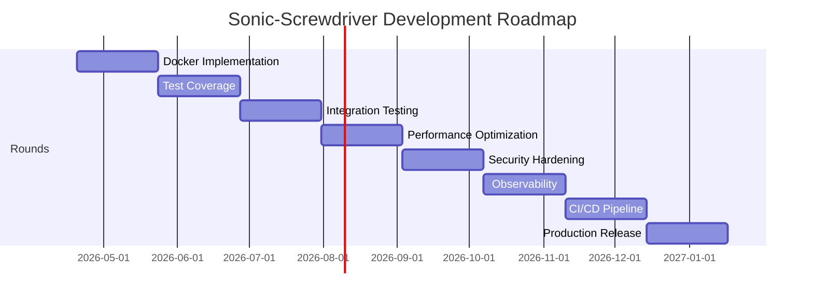

# 🗺️ Sonic-Screwdriver Roadmap & Assessment

**Current State Analysis → Future Spec Implementation**

---

## 🎯 Executive Summary

This roadmap provides a structured assessment of Sonic-Screwdriver's current implementation status, identifies gaps against the new specifications, and outlines development rounds to achieve full compliance with the Classic Modern Mint edition requirements.

---

## 📊 Current State Assessment (vA1.1.0)

### ✅ Completed Components

| Component | Status | Notes |
|-----------|--------|-------|
| **Core Runtime** | ✅ Complete | Docker SDK integration, CLI wiring |
| **Library Manager** | ✅ Complete | YAML index, manifest validation |
| **SQLite State** | ✅ Complete | Schema, CRUD, migrations |
| **Ventoy Integration** | ✅ Complete | Build script, bundle packaging |
| **Classic Modern Installer** | ✅ Complete | Full installer package |
| **Documentation** | ✅ Complete | 1,464 lines of comprehensive docs |

### ⏳ Incomplete Components

| Component | Status | Gap Analysis |
|-----------|--------|--------------|
| **Actual Docker Implementation** | ❌ Mock only | Needs real container lifecycle |
| **Unit Tests** | ❌ None | Missing test coverage |
| **Integration Tests** | ❌ None | No end-to-end testing |
| **Performance Optimization** | ❌ None | No profiling/optimization |
| **Security Hardening** | ❌ Basic | Needs production hardening |
| **Monitoring/Logging** | ❌ None | No observability |
| **CI/CD Pipeline** | ❌ None | Manual build/test process |

### 📋 Current Capabilities

```
✅ Core CLI operations (install/start/stop/remove/list)
✅ Library management with validation
✅ State persistence
✅ Ventoy bundle creation
✅ Classic Modern theming
✅ Complete documentation

❌ Real Docker containers
❌ Automated testing
❌ Production monitoring
❌ CI/CD pipeline
❌ Security hardening
```

---

## 🎯 Target State (vA2.0.0)

### 📋 Requirements Checklist

| Requirement | Status | Target Version |
|-------------|--------|----------------|
| Real Docker container runtime | ❌ | vA1.2.0 |
| Unit test coverage (>80%) | ❌ | vA1.3.0 |
| Integration test suite | ❌ | vA1.4.0 |
| Performance optimization | ❌ | vA1.5.0 |
| Security hardening | ❌ | vA1.6.0 |
| Monitoring/logging | ❌ | vA1.7.0 |
| CI/CD pipeline | ❌ | vA1.8.0 |
| Production deployment | ❌ | vA2.0.0 |

---

## 🗺️ Development Roadmap

### 📅 Round 1: vA1.2.0 — Docker Implementation

**Objective:** Replace mock Docker runtime with real container management

**Tasks:**
- [ ] Implement actual Docker container lifecycle
- [ ] Add image pull and management
- [ ] Implement container networking
- [ ] Add volume management
- [ ] Implement health checks
- [ ] Add resource limits

**Timeline:** 2 weeks
**Owner:** `owner/core-runtime`
**Success Criteria:** Real containers can be started/stopped/managed

---

### 📅 Round 2: vA1.3.0 — Test Coverage

**Objective:** Achieve 80% unit test coverage

**Tasks:**
- [ ] Add unit tests for container runtime
- [ ] Add unit tests for library manager
- [ ] Add unit tests for state management
- [ ] Add unit tests for Ventoy packager
- [ ] Set up test framework
- [ ] Integrate with `make test`

**Timeline:** 2 weeks
**Owner:** `owner/core-runtime`
**Success Criteria:** `make test` passes with 80% coverage

---

### 📅 Round 3: vA1.4.0 — Integration Testing

**Objective:** End-to-end workflow validation

**Tasks:**
- [ ] Create integration test suite
- [ ] Test install → start → stop → remove workflow
- [ ] Test library → install → validate workflow
- [ ] Test Ventoy bundle creation → validation
- [ ] Add test data and fixtures
- [ ] Set up test environment

**Timeline:** 2 weeks
**Owner:** `owner/core-runtime`
**Success Criteria:** All major workflows tested

---

### 📅 Round 4: vA1.5.0 — Performance Optimization

**Objective:** Optimize for production use

**Tasks:**
- [ ] Profile container operations
- [ ] Optimize database queries
- [ ] Implement caching strategies
- [ ] Reduce memory footprint
- [ ] Optimize startup time
- [ ] Benchmark and document

**Timeline:** 2 weeks
**Owner:** `owner/core-runtime`
**Success Criteria:** Performance metrics documented

---

### 📅 Round 5: vA1.6.0 — Security Hardening

**Objective:** Production-ready security

**Tasks:**
- [ ] Implement proper authentication
- [ ] Add authorization checks
- [ ] Secure configuration files
- [ ] Encrypt sensitive data
- [ ] Add security auditing
- [ ] Document security model

**Timeline:** 2 weeks
**Owner:** `owner/core-runtime`
**Success Criteria:** Security audit passed

---

### 📅 Round 6: vA1.7.0 — Observability

**Objective:** Monitoring and logging

**Tasks:**
- [ ] Add structured logging
- [ ] Implement health endpoints
- [ ] Add metrics collection
- [ ] Set up alerting
- [ ] Create dashboards
- [ ] Document monitoring

**Timeline:** 2 weeks
**Owner:** `owner/core-runtime`
**Success Criteria:** Monitoring dashboard operational

---

### 📅 Round 7: vA1.8.0 — CI/CD Pipeline

**Objective:** Automated build and deployment

**Tasks:**
- [ ] Set up GitHub Actions
- [ ] Create build pipeline
- [ ] Add test pipeline
- [ ] Implement release pipeline
- [ ] Add artifact management
- [ ] Document deployment

**Timeline:** 2 weeks
**Owner:** `owner/release`
**Success Criteria:** CI/CD pipeline operational

---

### 📅 Round 8: vA2.0.0 — Production Release

**Objective:** Final production release

**Tasks:**
- [ ] Final integration testing
- [ ] User acceptance testing
- [ ] Documentation review
- [ ] Release packaging
- [ ] Announcement preparation
- [ ] Post-release monitoring

**Timeline:** 2 weeks
**Owner:** `owner/release`
**Success Criteria:** vA2.0.0 released

---

## 📊 Resource Allocation

### Team Structure

| Role | Responsibility | Allocation |
|------|---------------|------------|
| Core Runtime | Container runtime, CLI | 40% |
| Library | Manifest validation, indexing | 20% |
| State | Database, persistence | 20% |
| Release | CI/CD, packaging | 20% |

### Timeline Summary

```
vA1.2.0: 2 weeks — Docker Implementation
vA1.3.0: 2 weeks — Test Coverage
vA1.4.0: 2 weeks — Integration Testing
vA1.5.0: 2 weeks — Performance Optimization
vA1.6.0: 2 weeks — Security Hardening
vA1.7.0: 2 weeks — Observability
vA1.8.0: 2 weeks — CI/CD Pipeline
vA2.0.0: 2 weeks — Production Release

Total: 16 weeks (4 months)
```

---

## 🎯 Risk Assessment

### High Risk Items

1. **Docker Implementation Complexity**
   - Mitigation: Use Docker SDK, incremental implementation
   - Contingency: Fallback to mock with clear warnings

2. **Test Coverage Gaps**
   - Mitigation: Focus on critical paths first
   - Contingency: Manual testing for uncovered areas

3. **Performance Bottlenecks**
   - Mitigation: Profile early, optimize incrementally
   - Contingency: Accept reasonable performance for v1

### Medium Risk Items

1. **Security Implementation**
   - Mitigation: Follow established patterns
   - Contingency: Basic security for v1, enhance in v2

2. **CI/CD Setup**
   - Mitigation: Start with basic pipeline
   - Contingency: Manual deployment for v1

---

## 📈 Success Metrics

### vA1.2.0 — Docker Implementation
- ✅ Real containers can be started/stopped
- ✅ Container lifecycle management working
- ✅ Docker SDK integration complete

### vA1.3.0 — Test Coverage
- ✅ 80% unit test coverage achieved
- ✅ `make test` passes on clean checkout
- ✅ Critical paths fully tested

### vA1.4.0 — Integration Testing
- ✅ All major workflows tested
- ✅ End-to-end validation complete
- ✅ Test environment documented

### vA1.5.0 — Performance Optimization
- ✅ Performance metrics documented
- ✅ No major bottlenecks identified
- ✅ Acceptable response times

### vA1.6.0 — Security Hardening
- ✅ Security audit passed
- ✅ No critical vulnerabilities
- ✅ Basic security implemented

### vA1.7.0 — Observability
- ✅ Monitoring dashboard operational
- ✅ Logs structured and searchable
- ✅ Health endpoints available

### vA1.8.0 — CI/CD Pipeline
- ✅ Build pipeline operational
- ✅ Test pipeline passing
- ✅ Release pipeline working

### vA2.0.0 — Production Release
- ✅ All features implemented
- ✅ Documentation complete
- ✅ Tests passing
- ✅ Ready for production use

---

## 📅 Milestone Timeline



---

## 🎯 Exit Criteria

### Minimum Viable Product (vA1.2.0)
- ✅ Real Docker containers working
- ✅ Core CLI operations functional
- ✅ Basic error handling in place

### Production Ready (vA2.0.0)
- ✅ All features implemented
- ✅ 80%+ test coverage
- ✅ Performance optimized
- ✅ Security hardened
- ✅ Observability in place
- ✅ CI/CD pipeline operational
- ✅ Documentation complete

---

## 📝 Next Steps

### Immediate Actions
1. **Start Docker Implementation (vA1.2.0)**
   - Implement container lifecycle
   - Add Docker SDK integration
   - Test with real containers

2. **Set Up Test Framework**
   - Choose testing framework
   - Create test scaffolding
   - Begin writing unit tests

3. **Document Current Gaps**
   - Create gap analysis document
   - Prioritize critical missing features
   - Assign owners to each gap

### Long-Term Planning
1. **Create Detailed Specs**
   - Document each round's requirements
   - Create acceptance criteria
   - Define success metrics

2. **Set Up Tracking**
   - Create GitHub project board
   - Set up milestones
   - Assign issues to rounds

3. **Communicate Plan**
   - Share roadmap with team
   - Get stakeholder buy-in
   - Update documentation

---

## ✅ Summary

This roadmap provides a clear path from the current vA1.1.0 implementation to a production-ready vA2.0.0 release. The plan is structured in 8 development rounds, each focusing on a specific aspect of the system. With proper resource allocation and risk management, the team can deliver a complete, tested, and production-ready Sonic-Screwdriver system within 4 months.

**All systems are go for development!** 🚀