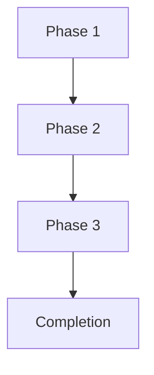
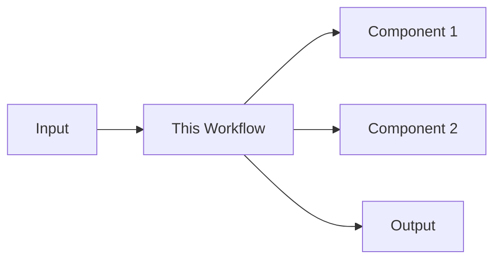

# [COMPONENT] [PROCESS] Workflow

## Overview

[Brief description of the workflow, its purpose, and when it should be used.]

## Workflow Phases

### Phase 1: [Phase Name]

**Trigger**: [What triggers this phase]

**Input**: [What inputs are required]

**Steps**:
1. [Step 1 description]
2. [Step 2 description]
3. [Step 3 description]

**Output**: [What this phase produces]

**Validation**: [How to validate this phase is complete]

**Success Criteria**: [Clear criteria for phase completion]

### Phase 2: [Phase Name]

**Trigger**: [What triggers this phase]

**Input**: [What inputs are required]

**Steps**:
1. [Step 1 description]
2. [Step 2 description]
3. [Step 3 description]

**Output**: [What this phase produces]

**Validation**: [How to validate this phase is complete]

**Success Criteria**: [Clear criteria for phase completion]

## Workflow Diagram



## Roles and Responsibilities

| Role | Responsibilities |
|------|-----------------|
| [Role 1] | [Specific responsibilities] |
| [Role 2] | [Specific responsibilities] |
| [Role 3] | [Specific responsibilities] |

## Environment Setup

### Prerequisites

- [Prerequisite 1]: [version/requirement]
- [Prerequisite 2]: [version/requirement]
- [Prerequisite 3]: [version/requirement]

### Environment Variables

| Variable | Default | Description |
|----------|---------|-------------|
| [VAR1] | [default] | [description] |
| [VAR2] | [default] | [description] |

### Setup Commands

```bash
# Install dependencies
[dependency installation commands]

# Configure environment
[environment configuration commands]

# Verify setup
[verification commands]
```

## Execution Commands

```bash
# Start workflow
[workflow start command]

# Run specific phase
[phase-specific command]

# Monitor progress
[monitoring command]

# Check status
[status command]
```

## Validation and Quality Gates

### Phase Validation

- **Phase 1 Validation**: [validation criteria and commands]
- **Phase 2 Validation**: [validation criteria and commands]
- **Phase 3 Validation**: [validation criteria and commands]

### Overall Success Criteria

- [ ] All phases completed successfully
- [ ] All validation checklists passed
- [ ] All output artifacts generated
- [ ] Documentation updated
- [ ] No critical blockers remaining

## Error Handling and Recovery

### Common Issues

| Issue | Symptoms | Resolution |
|-------|----------|------------|
| [Issue 1] | [Symptoms] | [Resolution steps] |
| [Issue 2] | [Symptoms] | [Resolution steps] |

### Recovery Procedures

```bash
# Recover from failure at Phase 1
[recovery commands]

# Recover from failure at Phase 2
[recovery commands]

# Rollback entire workflow
[rollback commands]
```

## Monitoring and Metrics

### Key Metrics

- **Cycle Time**: [how long workflow takes]
- **Success Rate**: [percentage of successful executions]
- **Failure Points**: [where failures typically occur]

### Monitoring Commands

```bash
# Check workflow status
[status command]

# View metrics
[metrics command]

# Generate report
[report command]
```

## Integration Points

### With Other Components

- **[Component 1]**: [integration description]
- **[Component 2]**: [integration description]
- **[Component 3]**: [integration description]

### Data Flow



## Documentation and Artifacts

### Generated Artifacts

- **Artifact 1**: [description and location]
- **Artifact 2**: [description and location]
- **Artifact 3**: [description and location]

### Documentation Updates

- [Document 1]: [what needs to be updated]
- [Document 2]: [what needs to be updated]
- [Document 3]: [what needs to be updated]

## Automation

### Automation Scripts

```bash
# Automate entire workflow
[automation script]

# Automate specific phase
[phase automation script]
```

### CI/CD Integration

```yaml
# Example CI/CD configuration
name: [Workflow Name]

on: [trigger]

jobs:
  workflow:
    runs-on: [runner]
    steps:
      - name: [Step 1]
        run: [command]
      - name: [Step 2]
        run: [command]
```

## Security Considerations

- **Access Control**: [who can execute this workflow]
- **Secrets Management**: [how secrets are handled]
- **Audit Logging**: [what gets logged]
- **Compliance**: [compliance requirements]

## Performance Considerations

- **Resource Requirements**: [CPU, memory, disk]
- **Execution Time**: [expected duration]
- **Scaling**: [how it scales with load]
- **Optimization**: [optimization opportunities]

## Deprecation and Migration

### Deprecation Plan

- **Deprecation Date**: [when this workflow will be deprecated]
- **Replacement**: [what replaces this workflow]
- **Migration Path**: [how to migrate to new workflow]

### Migration Steps

```bash
# Step 1: [migration step]
[migration command]

# Step 2: [migration step]
[migration command]
```

## Examples

### Example 1: [Use Case]

```bash
# Command sequence
[command 1]
[command 2]
[command 3]

# Expected output
[expected output]
```

### Example 2: [Use Case]

```bash
# Command sequence
[command 1]
[command 2]
[command 3]

# Expected output
[expected output]
```

## Best Practices

1. **Consistency**: [best practice 1]
2. **Documentation**: [best practice 2]
3. **Validation**: [best practice 3]
4. **Automation**: [best practice 4]

## Troubleshooting

### Debugging Commands

```bash
# Enable verbose output
[verbose command]

# Check intermediate state
[state check command]

# Validate environment
[environment validation command]
```

### Log Analysis

```bash
# View workflow logs
[log view command]

# Filter logs
[log filter command]

# Analyze failures
[failure analysis command]
```

## Related Workflows

- **[Related Workflow 1]**: [description and link]
- **[Related Workflow 2]**: [description and link]
- **[Related Workflow 3]**: [description and link]

## Change History

### [Version] - [Date]

- [Change description]
- [Impact assessment]
- [Migration notes]

### [Version] - [Date]

- [Change description]
- [Impact assessment]
- [Migration notes]

## Appendix

### Glossary

- **Term 1**: [definition]
- **Term 2**: [definition]
- **Term 3**: [definition]

### References

- [Reference 1]: [link/description]
- [Reference 2]: [link/description]
- [Reference 3]: [link/description]