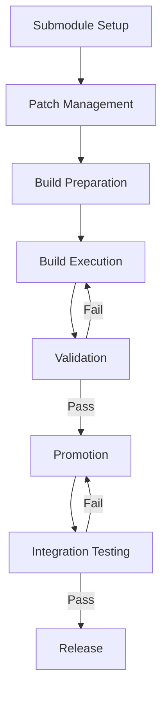

# Ventoy Integration Workflow

## Overview

This workflow defines how Ventoy is integrated into the Sonic Family build and release process.

## Workflow Phases

### 1. Submodule Setup

**Trigger**: Initial repository setup or submodule update

**Steps**:
1. Add Ventoy submodule: `git submodule add https://github.com/fredporter/Ventoy`
2. Initialize submodule: `git submodule update --init --recursive`
3. Verify submodule: `git submodule status Ventoy`

**Output**: Ventoy source available in `Ventoy/`

### 2. Patch Management

**Trigger**: New Ventoy patches available

**Steps**:
1. Add patch files to `modules/ventoy/patches/`
2. Update patch README: `modules/ventoy/patches/README.md`
3. Document patch purpose and compatibility
4. Update integration brief: `dev/integration/VENTOY-INTEGRATION-BRIEF.md`

**Output**: Patches ready for application

### 3. Build Preparation

**Trigger**: Ready to build Ventoy artifacts

**Steps**:
1. Review build script: `modules/ventoy/build.sh`
2. Set environment variables if needed
3. Verify patches are in place
4. Check build dependencies

**Output**: Build environment ready

### 4. Build Execution

**Trigger**: Build command issued

**Steps**:
1. Run build script: `./modules/ventoy/build.sh`
2. Monitor build output
3. Check for errors or warnings
4. Verify build completion

**Output**: Ventoy artifacts in build directory

### 5. Validation

**Trigger**: Build completion

**Steps**:
1. Run validation checklist: `dev/process/checklists/ventoy-validation.md`
2. Execute validation script: `./modules/ventoy/validate.sh`
3. Document validation results
4. Address any validation failures

**Output**: Validated Ventoy artifacts

### 6. Promotion

**Trigger**: Validation passed

**Steps**:
1. Prepare release directory
2. Copy artifacts to release: `cp -v $VENTOY_BUILD_DIR/* $VENTOY_RELEASE_DIR/`
3. Set correct permissions
4. Generate manifest
5. Verify promotion

**Output**: Promoted Ventoy artifacts ready for distribution

### 7. Integration Testing

**Trigger**: Promoted artifacts available

**Steps**:
1. Test Ventoy image creation
2. Test bootable USB creation
3. Test USXD handoff (if applicable)
4. Document test results

**Output**: Integration test results

### 8. Release

**Trigger**: All tests passed

**Steps**:
1. Update release notes
2. Tag release in git
3. Push tags to remote
4. Announce release

**Output**: Released Ventoy artifacts

## Workflow Diagram

## Environment Variables

| Variable | Default | Description |
|----------|---------|-------------|
| `SONIC_VENTOY_ROOT` | `$(pwd)/Ventoy` | Path to Ventoy submodule |
| `VENTOY_BUILD_DIR` | `$(pwd)/build/ventoy` | Build output directory |
| `VENTOY_RELEASE_DIR` | `$(pwd)/release/ventoy` | Release promotion directory |
| `VENTOY_PATCHES_DIR` | `$(pwd)/modules/ventoy/patches` | Patches directory |

## Scripts Reference

| Script | Purpose |
|--------|---------|
| `modules/ventoy/build.sh` | Build Ventoy with patches |
| `modules/ventoy/validate.sh` | Validate build artifacts |
| `modules/ventoy/promote.sh` | Promote to release (future) |

## Checklists

- **Build Checklist**: `dev/process/checklists/ventoy-build.md` (future)
- **Validation Checklist**: `dev/process/checklists/ventoy-validation.md`
- **Promotion Checklist**: `dev/process/checklists/ventoy-promotion.md` (future)

## Integration Points

### With Sonic Screwdriver

- CLI commands for Ventoy operations
- Environment variable discovery
- Cross-component validation

### With uHomeNest

- USXD handoff workflows
- Boot media compatibility
- Release coordination

## Monitoring and Metrics

- Build success/failure rate
- Validation pass/fail rate
- Promotion cycle time
- Integration test coverage

## Continuous Improvement

- Review workflow after each release
- Identify bottlenecks and pain points
- Automate manual steps where possible
- Update documentation with lessons learned

## Troubleshooting

See `dev/process/checklists/ventoy-validation.md` for troubleshooting guide.