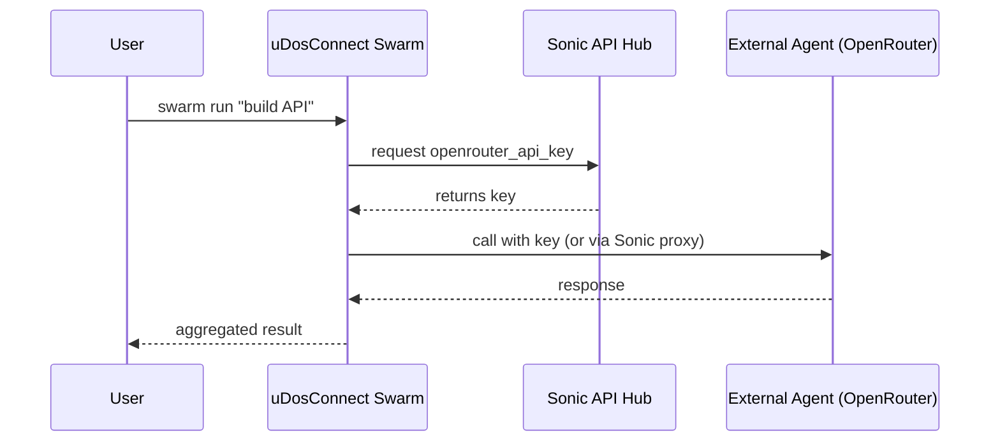
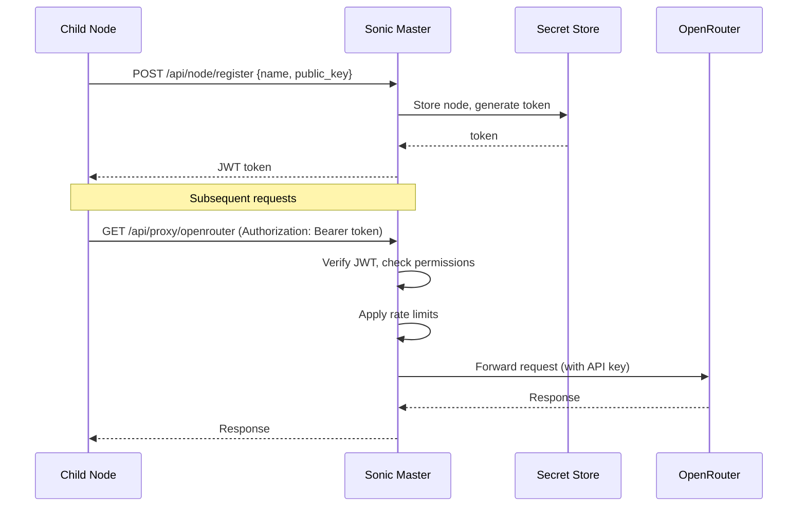

# 🐝 Architecture Clarification: uDos Swarm Orchestration + Sonic API Central Hub

## Core Principle

| Component             | Role                         | Responsibility                                                                             |
| --------------------- | ---------------------------- | ------------------------------------------------------------------------------------------ |
| **Sonic-Screwdriver** | API Central Hub              | Stores all API keys, manages secrets, handles authentication, provides unified API gateway |
| **uDosConnect**       | Swarm Orchestrator           | Multi-agent coordination, task decomposition, parallel execution, agent communication      |
| **uHomeNest**         | Home Automation Bridge       | Home devices, scenes, automation rules (uses Sonic APIs)                                   |
| **uDevFramework**     | Documentation & Coordination | Cross-repo specs, agent-aware documentation                                                |

***

## Updated Architecture Diagram

````
┌─────────────────────────────────────────────────────────────────────────────┐
│                         Sonic-Screwdriver (API Central Hub)                 │
│  ┌─────────────┐  ┌─────────────┐  ┌─────────────┐  ┌─────────────────────┐ │
│  │ Secret Store│  │ API Gateway │  │ Auth Proxy  │  │ Rate Limiter        │ │
│  │ (master key)│  │ (unified    │  │ (JWT, mTLS) │  │ (Redis)             │ │
│  └─────────────┘  └──────┬──────┘  └─────────────┘  └─────────────────────┘ │
│                          │                                                   │
│                    All API calls routed through Sonic                        │
└──────────────────────────┼───────────────────────────────────────────────────┘
                           │
        ┌──────────────────┼──────────────────┬──────────────────┐
        ▼                  ▼                  ▼                  ▼
┌───────────────┐  ┌───────────────┐  ┌───────────────┐  ┌───────────────┐
│  uDosConnect  │  │  uHomeNest    │  │  External     │  │  Child Nodes  │
│  (Swarm       │  │  (Home Auto)  │  │  Services     │  │  (Agents)     │
│  Orchestrator)│  │               │  │  (GitHub, etc)│  │               │
│               │  │               │  │               │  │               │
│ • Task planner│  │ • Device mgmt │  │ • Webhooks    │  │ • Local exec  │
│ • Agent registry│ │ • Scene ctrl  │  │ • OAuth       │  │ • Report back │
│ • Parallel exec│  │ • Automation  │  │               │  │               │
└───────────────┘  └───────────────┘  └───────────────┘  └───────────────┘
        │                  │                  │                  │
        └──────────────────┴──────────────────┴──────────────────┘
                           │
                    All components call Sonic for API keys
````

***

## Phase 1: Sonic as API Central Hub

### 1.1 Secret Store (Master Key)

```bash
# Sonic holds all API keys
sonic secret add openrouter_api_key --value "sk-..."
sonic secret add deepseek_api_key --value "sk-..."
sonic secret add github_token --value "ghp_..."

# Other components request keys via authenticated calls
curl -H "Authorization: Bearer $NODE_TOKEN" \
     https://sonic.local:3010/api/secrets/openrouter_api_key
```

### 1.2 API Gateway Pattern

All outbound API calls from any component go through Sonic:

```typescript
// Instead of calling OpenAI directly, components call Sonic
const response = await fetch('https://sonic.local:3010/api/proxy/openrouter', {
    method: 'POST',
    headers: { 'Authorization': `Bearer ${nodeToken}` },
    body: JSON.stringify({ prompt, model: 'claude-3.5-sonnet' })
});
```

**Benefits:**

- Single place for API key rotation
- Unified rate limiting
- Central audit logging
- Consistent error handling

***

## Phase 2: uDosConnect Swarm Orchestrator

### 2.1 Swarm Commands (No API keys stored locally)

```bash
# uDosConnect uses Sonic for all API needs
udo swarm run "Build a REST API with authentication"

# Internally, uDosConnect:
# 1. Calls Sonic to get openrouter_api_key
# 2. Uses that key to call OpenRouter (or Sonic proxies the call)
# 3. Orchestrates agents
```

### 2.2 Agent Registry

```yaml
# .dev/agents/swarm.yaml
agents:
  - name: planner
    type: openrouter
    model: claude-3.5-sonnet
    api_source: sonic  # gets key from Sonic
    
  - name: coder
    type: dsc2
    endpoint: http://localhost:30000
    api_source: none  # local, no key needed
    
  - name: researcher
    type: gemini
    api_source: sonic  # gets key from Sonic
```

### 2.3 Swarm Execution Flow



***

## Phase 3: Sonic TUI Updates

### 3.1 Add Swarm & Secret Sections

```go
// cmd/sonic/tui.go - updated items list
var items = []list.Item{
    // ... existing items ...
    item{title: "Secret Management", desc: "Store and share API keys (central hub)", status: "planned", command: "sonic secret"},
    item{title: "Swarm Orchestration", desc: "Multi-agent coordination (via uDos)", status: "planned", command: "sonic swarm"},
    item{title: "API Proxy Status", desc: "View active API proxies and rate limits", status: "planned", command: "sonic proxy status"},
}
```

### 3.2 Secret Commands

```bash
# Add a secret
sonic secret add openrouter_api_key --value "sk-..."

# List secrets (names only, values hidden)
sonic secret list

# Grant access to a node
sonic secret grant openrouter_api_key --node child-laptop

# Revoke access
sonic secret revoke openrouter_api_key --node child-laptop

# Show proxy status
sonic proxy status
# openrouter: 1234 calls today, 0 errors, rate limit 60/min
# deepseek: 5678 calls today, 2 errors, rate limit 100/min
```

***

## Phase 4: Child Node Integration

### 4.1 Child Registration

```bash
# On child node
sonic node register --master master.local --name child-laptop

# This:
# 1. Generates node key pair
# 2. Sends public key to master
# 3. Receives signed token
# 4. Stores token in ~/.local/venv/sonic.token
```

### 4.2 Child Making API Calls

```bash
# Child wants to use OpenRouter
curl -H "Authorization: Bearer $(cat ~/.local/venv/sonic.token)" \
     https://master.local:3010/api/proxy/openrouter \
     -d '{"prompt":"hello"}'
```

### 4.3 uDosConnect on Child

```bash
# On child, uDosConnect swarm still works
udo swarm run "analyze this code" --local

# It uses local DSC2 (no API key) for code tasks
# For external APIs, it calls Sonic proxy
```

***

## Phase 5: Environment Variables (No Hardcoded Keys)

All components source API keys from Sonic at runtime, never from `.env`:

```bash
# WRONG - never do this
# OPENROUTER_API_KEY=sk-...

# RIGHT - get from Sonic at runtime
export OPENROUTER_API_KEY=$(sonic secret get openrouter_api_key --quiet)
```

***

## Phase 6: Implementation Order

### Priority 0: Sonic API Hub (Foundation)

- [ ] Secret store with encryption
- [ ] API proxy with rate limiting
- [ ] Node registration and authentication
- [ ] `sonic secret` commands

### Priority 1: uDosConnect Swarm (Uses Sonic)

- [ ] Agent registry (reads from Sonic)
- [ ] Task decomposition (uses Sonic proxy for LLM)
- [ ] Parallel execution
- [ ] `udo swarm` commands

### Priority 2: uHomeNest (Uses Sonic)

- [ ] Home automation rules
- [ ] Device control (via Sonic proxy if needed)

### Priority 3: Ventoy & USB Creation

- [ ] `sonic ventoy` commands
- [ ] Master ISO builder

***

## Success Criteria

- [ ] Sonic is the ONLY place API keys are stored
- [ ] No hardcoded keys in any component
- [ ] uDosConnect swarm works without local keys
- [ ] Child nodes can request keys from master Sonic
- [ ] All API calls go through Sonic proxy (or are verified)
- [ ] TUI shows planned features with 🔜 icon

***

## Handover Block

````
Agent:

Implement the architecture where:

1. Sonic-Screwdriver is the API Central Hub:
   - Stores all API keys encrypted
   - Provides proxy endpoints for external APIs
   - Manages node authentication and tokens

2. uDosConnect handles Swarm Orchestration:
   - Reads agent configs (keys obtained from Sonic)
   - Decomposes tasks, executes agents in parallel
   - No local API key storage

3. All components call Sonic for any external API access

Priority order:
- First: Sonic secret store + API proxy
- Second: uDosConnect swarm using Sonic
- Third: TUI updates for secret/swarm sections

Report back after each major component is functional.
````

# 🎛️ Sonic-Screwdriver v2.0: API Central Hub & Master Node Controller

## Document: `SONIC_SCREWDRIVER_v2.0_SPEC.md`

**Status:** Active Development  
**Version:** 2.0.0  
**Last Updated:** 2026-04-21  
**Role:** API Central Hub, Master Node Controller, Unified CLI

***

## 1. Core Mission

Sonic-Screwdriver is the **central nervous system** of the uDos ecosystem:

- **API Central Hub** – Stores all API keys, provides unified proxy gateway
- **Master Node Controller** – Manages always-on home server, coordinates children
- **Unified CLI** – TUI menu system, all commands in one place
- **Security Layer** – Authentication, rate limiting, audit logging

**Not responsible for:** Swarm orchestration (that's uDosConnect's job)

***

## 2. Architecture Overview

````
┌─────────────────────────────────────────────────────────────────────────────┐
│                         Sonic-Screwdriver v2.0                              │
│                                                                              │
│  ┌─────────────┐  ┌─────────────┐  ┌─────────────┐  ┌─────────────────────┐ │
│  │ Secret Store│  │ API Proxy   │  │ Node        │  │ TUI Menu            │ │
│  │ (encrypted) │  │ (rate limit)│  │ Registry    │  │ (bubbletea)         │ │
│  └─────────────┘  └──────┬──────┘  └─────────────┘  └─────────────────────┘ │
│                          │                                                   │
│                    All external API calls go through Sonic                   │
└──────────────────────────┼───────────────────────────────────────────────────┘
                           │
        ┌──────────────────┼──────────────────┬──────────────────┐
        ▼                  ▼                  ▼                  ▼
┌───────────────┐  ┌───────────────┐  ┌───────────────┐  ┌───────────────┐
│  uDosConnect  │  │  uHomeNest    │  │  Child Nodes  │  │  External     │
│  (Swarm)      │  │  (Home Auto)  │  │  (Agents)     │  │  Services     │
│  • No API keys│  │  • No API keys│  │  • Get tokens │  │  • OpenAI     │
│  • Calls Sonic│  │  • Calls Sonic│  │  • Call proxy │  │  • Anthropic  │
└───────────────┘  └───────────────┘  └───────────────┘  └───────────────┘
````

***

## 3. Secret Store (API Key Management)

### 3.1 Location & Encryption

````
/etc/udos/
├── master.key          # 32-byte master key (generated once)
├── secrets.enc         # Encrypted JSON (AES-256-GCM)
└── registry.db         # SQLite: nodes, permissions
````

### 3.2 Secret Schema (decrypted)

```json
{
  "version": 2,
  "secrets": {
    "openrouter_api_key": "sk-or-...",
    "deepseek_api_key": "sk-...",
    "github_token": "ghp_...",
    "anthropic_api_key": "sk-ant-..."
  },
  "policies": {
    "openrouter_api_key": {
      "allowed_nodes": ["master", "child-laptop", "child-pi"],
      "allowed_roles": ["admin", "developer"],
      "rate_limit": "60/min"
    }
  }
}
```

### 3.3 Commands

```bash
# Add a secret (master only)
sonic secret add openrouter_api_key --value "sk-..."

# List secrets (names only, values hidden)
sonic secret list
# openrouter_api_key (allowed: master, child-laptop)
# deepseek_api_key (allowed: all nodes)

# Get a secret value (requires authentication)
sonic secret get openrouter_api_key

# Grant access to a node
sonic secret grant openrouter_api_key --node child-laptop

# Revoke access
sonic secret revoke openrouter_api_key --node child-laptop

# Show secret policies
sonic secret policy openrouter_api_key
```

***

## 4. API Proxy Gateway

### 4.1 Proxy Endpoints

| Endpoint                | Upstream          | Purpose                    |
| ----------------------- | ----------------- | -------------------------- |
| `/api/proxy/openrouter` | OpenRouter API    | LLM access (Claude, GPT-4) |
| `/api/proxy/deepseek`   | DeepSeek API      | Code generation            |
| `/api/proxy/gemini`     | Google Gemini API | Research, web search       |
| `/api/proxy/github`     | GitHub API        | Repository operations      |
| `/api/proxy/anthropic`  | Anthropic API     | Claude direct              |

### 4.2 Proxy Usage

```bash
# Component calls Sonic proxy (not the API directly)
curl -X POST https://master.local:3010/api/proxy/openrouter \
  -H "Authorization: Bearer $(cat ~/.local/venv/sonic.token)" \
  -H "Content-Type: application/json" \
  -d '{
    "model": "claude-3.5-sonnet",
    "messages": [{"role": "user", "content": "Hello"}]
  }'
```

### 4.3 Proxy Features

- **Rate limiting** – Per node, per API key
- **Request/response logging** – Audit trail
- **Circuit breaker** – Stop calling failing APIs
- **Retry with backoff** – Handle transient errors
- **Response caching** – For identical requests

### 4.4 Proxy Status Command

```bash
sonic proxy status

# Output:
# ┌─────────────┬──────────┬────────────┬─────────────┬──────────────┐
# │ Provider    │ Calls    │ Errors     │ Rate Limit  │ Status       │
# ├─────────────┼──────────┼────────────┼─────────────┼──────────────┤
# │ openrouter  │ 1,234    │ 12 (0.97%) │ 60/min      │ 🟢 healthy    │
# │ deepseek    │ 5,678    │ 3 (0.05%)  │ 100/min     │ 🟢 healthy    │
# │ gemini      │ 890      │ 45 (5.06%) │ 60/min      │ 🟡 degraded   │
# │ github      │ 234      │ 0 (0%)     │ 5000/hour   │ 🟢 healthy    │
# └─────────────┴──────────┴────────────┴─────────────┴──────────────┘
```

***

## 5. Node Registry & Authentication

### 5.1 Node Registration

```bash
# On child node
sonic node register --master master.local --name child-laptop

# What happens:
# 1. Generates key pair: ~/.local/venv/sonic.key (private) and .pub
# 2. Sends public key to master
# 3. Master stores in registry.db, returns signed JWT
# 4. Token saved to ~/.local/venv/sonic.token
```

### 5.2 Node Commands

```bash
# On master
sonic node list
# ID          NAME          STATUS     LAST SEEN
# nd_abc123   master        online     2s ago
# nd_def456   child-laptop  online     5s ago
# nd_ghi789   child-pi      offline    2h ago

sonic node show child-laptop
# Node: child-laptop
#   ID: nd_def456
#   Status: online
#   IP: 192.168.1.45
#   Last seen: 2026-04-21T10:30:00Z
#   Allowed secrets: openrouter_api_key, deepseek_api_key

sonic node revoke child-laptop
# Revokes token, removes access
```

### 5.3 Authentication Flow



***

## 6. TUI Menu System

### 6.1 Launch TUI

```bash
sonic           # no args = TUI
sonic tui
sonic menu
```

### 6.2 Menu Structure

````
┌────────────────────────────────────────────────────────────────┐
│ 🎛️ Sonic-Screwdriver Control Panel                              │
├────────────────────────────────────────────────────────────────┤
│                                                                  │
│   ✅ Game Management          Install, start, stop games        │
│   ✅ Health Monitoring        Check container health, auto-repair│
│   ✅ Container Management     List, logs, exec into containers   │
│   ✅ Ventoy Operations        Package, validate, deploy ISO      │
│   ✅ Secret Management        Store API keys (central hub)       │
│   🔜 Master Node Setup        Initialize as uDos master          │
│   🔜 Network Sync             Sync with other nodes              │
│   🔜 Swarm Orchestration      Multi-agent (via uDosConnect)      │
│   🔜 API Proxy Status         View proxy health and stats        │
│                                                                  │
│   [q] quit • [enter] select                                     │
└────────────────────────────────────────────────────────────────┘
````

### 6.3 Planned Features (🔜)

Features marked with 🔜 are **spec'd but not yet implemented** – they will show a message:

````
🔜 Feature planned but not yet implemented: Master Node Setup
   See: https://docs.udos.local/roadmap/master-node
````

***

## 7. Master Node Setup (One-Time)

### 7.1 Installation Script

```bash
# Run ONCE on the always-on home server
curl -fsSL https://get.udos.local/install-master.sh | bash
```

**What the script does:**

1. Installs Docker, Go, Node.js, SQLite, OpenSSL
2. Clones and builds `sonic-screwdriver`
3. Clones and builds `uDosConnect` (for swarm orchestration)
4. Initializes master node (generates keys, creates databases)
5. Sets up systemd services for MCP and web portal
6. Configures mDNS (Avahi) for `.local` resolution
7. Optionally installs Ventoy for USB creation

### 7.2 Manual Setup

```bash
# Step by step
git clone https://github.com/fredporter/sonic-screwdriver.git
cd sonic-screwdriver
go build -o sonic ./cmd/sonic
sudo cp sonic /usr/local/bin/

sudo sonic master init
sudo systemctl enable udos-mcp udos-web
sudo systemctl start udos-mcp udos-web
```

***

## 8. Integration with Other Components

### 8.1 uDosConnect (Swarm Orchestrator)

```typescript
// uDosConnect gets API keys from Sonic
const apiKey = await fetch('http://sonic.local:3010/api/secrets/openrouter_api_key', {
    headers: { 'Authorization': `Bearer ${nodeToken}` }
});

// Or use Sonic proxy
const response = await fetch('http://sonic.local:3010/api/proxy/openrouter', {
    method: 'POST',
    headers: { 'Authorization': `Bearer ${nodeToken}` },
    body: JSON.stringify({ prompt, model: 'claude-3.5-sonnet' })
});
```

### 8.2 uHomeNest (Home Automation)

```python
# uHomeNest gets device control APIs from Sonic
# (e.g., Hue bridge token stored in Sonic)
hue_token = sonic.secret.get('hue_bridge_token')
```

### 8.3 Child Nodes

```bash
# Child node registers with master
sonic node register --master master.local --name my-laptop

# Now child can use Sonic proxy
sonic proxy call openrouter --data '{"prompt":"hello"}'
```

***

## 9. Security Model

| Layer              | Mechanism                                                     |
| ------------------ | ------------------------------------------------------------- |
| **Transport**      | TLS (HTTPS/WSS) for all external communication                |
| **Authentication** | JWT tokens signed by master, per-node keys                    |
| **Authorization**  | Per-secret node allowlist, role-based access                  |
| **Secrets**        | AES-256-GCM encrypted at rest, master key never leaves master |
| **Rate Limiting**  | Redis sliding window, per-node limits                         |
| **Audit**          | All API calls logged to immutable SQLite table                |

***

## 10. CLI Command Reference

### Core Commands

```bash
sonic [tui|menu]                    # Launch TUI
sonic --version                     # Show version
sonic help                          # Show help
```

### Secret Management

```bash
sonic secret add <name> --value <key>
sonic secret list
sonic secret get <name>
sonic secret grant <name> --node <node>
sonic secret revoke <name> --node <node>
sonic secret policy <name>
```

### Node Management

```bash
sonic node register --master <addr> --name <name>
sonic node list
sonic node show <name>
sonic node revoke <name>
sonic node token <name>             # Regenerate token
```

### API Proxy

```bash
sonic proxy status
sonic proxy call <provider> --data <json>
sonic proxy reset --provider <name>  # Reset rate limits
```

### Game/Container Management

```bash
sonic library list
sonic install <game>
sonic start <game>
sonic stop <game>
sonic health --game <game>|--all
sonic repair --game <game>|--all
sonic logs <game>
sonic ps
```

### Ventoy (USB Creation)

```bash
sonic ventoy package --input <iso> --output <bundle>
sonic ventoy validate <bundle>
sonic ventoy info <bundle>
sonic ventoy list-devices
```

### Master Node (Admin Only)

```bash
sudo sonic master init
sudo sonic master status
sudo sonic master backup
sudo sonic master restore --file <backup>
```

***

## 11. Environment Variables (No Hardcoded Keys)

```bash
# WRONG - never do this in any component
# OPENROUTER_API_KEY=sk-...

# RIGHT - get from Sonic at runtime
export OPENROUTER_API_KEY=$(sonic secret get openrouter_api_key --quiet)

# Or use proxy URL
export OPENROUTER_PROXY="https://master.local:3010/api/proxy/openrouter"
```

***

## 12. Success Criteria

- [ ] Sonic is the ONLY place API keys are stored
- [ ] No hardcoded keys in any component's code or `.env`
- [ ] TUI shows all commands with live/planned status
- [ ] Master node can be initialized with one command
- [ ] Child nodes can register and receive tokens
- [ ] API proxy works with rate limiting and logging
- [ ] Secret store encrypted at rest
- [ ] All components call Sonic for external API access

***

## 13. Roadmap

| Version | Focus                              | Status         |
| ------- | ---------------------------------- | -------------- |
| v1.0    | Basic container management         | ✅ Released    |
| v1.1    | Health monitoring, auto-repair     | ✅ Released    |
| v2.0    | API Central Hub, Secret Store, TUI | 🔜 In Progress |
| v2.1    | Full proxy implementation          | 📋 Planned     |
| v2.2    | Multi-node sync                    | 📋 Planned     |
| v3.0    | Swarm integration with uDosConnect | 📋 Planned     |

***

**Sonic-Screwdriver v2.0 transforms from a simple container manager into the central API hub for the entire uDos ecosystem.** 🎛️

# ✅ Plan Assessment: Sonic-Screwdriver v2.0 as API Central Hub

## Overall Verdict: **Excellent Plan** – Proceed with Minor Adjustments

This is a well-thought-out architecture. The separation of concerns is clean:

- **Sonic** = API keys, proxy, node registry (security & infrastructure)
- **uDosConnect** = Swarm orchestration, agent coordination (logic & intelligence)
- **uHomeNest** = Home automation (domain-specific)

***

## What Works Well

| Aspect                              | Why It's Good                                         |
| ----------------------------------- | ----------------------------------------------------- |
| **Single source of truth for keys** | No key sprawl, easy rotation, one place to audit      |
| **Proxy pattern**                   | Components don't need to know about keys at all       |
| **TUI with planned indicators**     | Users see what's coming, no surprise missing features |
| **Node registration with JWT**      | Standard, secure, expiration support                  |
| **Encrypted secret store**          | AES-256-GCM is industry standard                      |
| **Systemd services**                | Proper daemon management on Linux Mint                |

***

## Suggestions for Improvement

### 1. Add Offline Mode Support

When master is unreachable, components should fall back to local cached keys (with warning).

```bash
sonic secret get openrouter_api_key --allow-cached
# Warns: ⚠️ Using cached key (master unreachable since 2026-04-21)
```

### 2. Secret Versioning & Rotation

```bash
sonic secret rotate openrouter_api_key --new-value "sk-new..."
sonic secret history openrouter_api_key
# Shows previous keys and when they were rotated
```

### 3. Proxy Health Endpoint

Add `/api/proxy/health` that checks all upstream APIs:

```bash
sonic proxy health
# openrouter: ✅ (200ms)
# deepseek: ✅ (150ms)
# gemini: ❌ (401 unauthorized - check key)
```

### 4. Automatic Key Testing on Add

When adding a secret, test it immediately:

```bash
sonic secret add openrouter_api_key --value "sk-..." --test
# Testing key... ✅ Valid (models: 127 available)
```

### 5. Backup & Restore Commands

```bash
sonic master backup --output ~/backups/sonic-$(date +%Y%m%d).enc
sonic master restore --input ~/backups/sonic-20260421.enc --passphrase
```

### 6. Child Node Auto-Registration (mDNS-based)

```bash
# On child, auto-discover master
sonic node discover
# Found master at master.local (192.168.1.100)
# Register? (y/n)
```

### 7. Rate Limit Dashboard in TUI

Add real-time rate limit usage to TUI status screen:

````
📊 Rate Limit Usage (last hour)
openrouter: ████████░░ 78% (47/60 per min)
deepseek:   ████░░░░░░ 34% (34/100 per min)
gemini:     ██████████ 100% (60/60 - rate limited!)
````

### 8. Secret Expiry Notifications

```bash
sonic secret set-expiry openrouter_api_key --days 30
# When expired: sends warning to admin email
```

### 9. Multi-Master Failover (Future)

For high availability, allow secondary master with replicated secrets:

```bash
sonic master replicate --to backup.local
# Keeps encrypted secrets in sync
```

### 10. CLI Completion

Add bash/zsh completion for all commands:

```bash
source <(sonic completion bash)
```

***

## Revised Priority Order

| Priority | Item                         | Change     |
| -------- | ---------------------------- | ---------- |
| P0       | Secret store + basic proxy   | As planned |
| P0       | Node registration + JWT      | As planned |
| P0       | TUI with planned indicators  | As planned |
| P1       | Automatic key testing on add | **Add**    |
| P1       | Backup & restore commands    | **Add**    |
| P1       | Proxy health endpoint        | **Add**    |
| P2       | Offline mode with cache      | **Add**    |
| P2       | Secret rotation & history    | **Add**    |
| P2       | Rate limit dashboard in TUI  | **Add**    |
| P3       | Auto-discovery via mDNS      | **Add**    |
| P3       | Secret expiry notifications  | **Add**    |
| Future   | Multi-master failover        | **Add**    |

***

## Minor Concern: Single Point of Failure

**Issue:** If master goes down, no component can get new keys or make API calls.

**Mitigation:**

- Add offline cache (suggestion #1)
- Document recovery procedure
- Consider adding a read-only backup master (future)

***

## Updated Architecture Diagram (with suggestions)

````
┌─────────────────────────────────────────────────────────────────────────────┐
│                    Sonic-Screwdriver v2.0 (API Central Hub)                 │
│                                                                              │
│  ┌─────────────┐  ┌─────────────┐  ┌─────────────┐  ┌─────────────────────┐ │
│  │ Secret Store│  │ API Proxy   │  │ Node        │  │ TUI Menu            │ │
│  │ (encrypted, │  │ (rate limit,│  │ Registry    │  │ (with live stats)   │ │
│  │  versioned) │  │  health)    │  │             │  │                     │ │
│  └─────────────┘  └──────┬──────┘  └─────────────┘  └─────────────────────┘ │
│                          │                                                   │
│                    ┌─────┴─────┐                                             │
│                    │  Backup   │  (offline cache, replication)              │
│                    │  Restore  │                                             │
│                    └───────────┘                                             │
└─────────────────────────────────────────────────────────────────────────────┘
````

***

## Final Recommendation

**Proceed with the plan as described, plus these additions:**

1. **P1 additions** (do in same sprint as P0):

   - Automatic key testing on add
   - Backup/restore commands
   - Proxy health endpoint

2. **P2 additions** (next sprint):

   - Offline mode with cache
   - Rate limit dashboard in TUI
   - Secret rotation

3. **Documentation** to add:

   - Recovery procedure if master is down
   - How to rotate master key
   - Backup schedule recommendation


**The plan is solid. Execute with confidence.** 🎛️